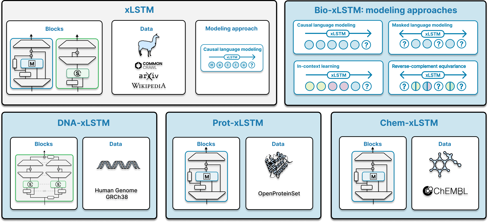

<p align="center">
    
</p>

# Prot-xLSTM

This repository provides the code necessary to reproduce the experiments presented in the paper [Bio-xLSTM: Generative modeling, representation and in-context learning of biological and chemical sequences](https://arxiv.org/abs/2411.04165). The code is organized across the following repositories:

- [Prot-xLSTM](https://github.com/ml-jku/Prot-xLSTM) (current repository) 
- [DNA-xLSTM](https://github.com/ml-jku/DNA-xLSTM) 
- [Chem-xLSTM](https://github.com/ml-jku/Chem-xLSTM)

## Quickstart

### Installation

```bash
git clone https://github.com/ml-jku/Prot-xLSTM.git
cd Prot-xLSTM
conda env create -f prot_xlstm_env.yaml
conda activate prot_xlstm
pip install -e .
```

This package also supports the use of [ProtMamba](https://github.com/Bitbol-Lab/ProtMamba-ssm) and ProtTransformer++ models. If you want to enable flash attention for the transformer model, install `flash-attn` separately.

### Model Weights and Pre-Processed Data

Model weights and the processed dataset can be downloaded [here](https://ml.jku.at/research/Bio-xLSTM/downloads/Prot-xLSTM/data/). To reproduce the results, place the model weights in a `checkpoints/` folder and copy the dataset to the `data/` folder.

### Applications

For an easy start with Prot-xLSTM applications, we provide two sample notebooks:

- [`examples/generation.ipynb`](https://github.com/ml-jku/Prot-xLSTM/blob/main/examples/generation.ipynb): This notebook demonstrates how to generate and evaluate novel protein sequences based on a set context sequences. 

- [`examples/variant_fitness.ipynb`](https://github.com/ml-jku/Prot-xLSTM/blob/main/examples/variant_fitness.ipynb): This notebook enables you to assess the mutational effects of amino acid substitutions on a target sequence, with the option to include context proteins as well.

### Repository Structure

- `configs/`: Configuration files for model training.
- `data/`: Train, validation and test splits of the dataset. 
- `evaluation/`: Scripts to reproduce experiments and figures from the paper.
    - `evaluation/generation/`: Homology-conditioned sequence generation.
    - `evaluation/pretraining/`: Learning curves and test set performance.
    - `evaluation/proteingym/`: ProteinGym DMS substitution benchmark.
- `examples/`: Example notebooks for Prot-xLSTM applications.
- `protxlstm/`: Implementation of Prot-xLSTM.


## Pretraining

### Data

Download preprocessed data from [here](https://ml.jku.at/research/Bio-xLSTM/downloads/Prot-xLSTM/data/) or download raw multiple-sequence alignment files from the [OpenProteinSet](https://registry.opendata.aws/openfold/) dataset using:

```bash
aws s3 cp s3://openfold/uniclust30/data/a3m_files/ --recursive --no-sign-request --exclude "*" --include "*.a3m"
```

and preprocess data with (this takes several hours!):

```bash
python protxlstm/data.py
```

### Model Training

To train a Prot-xLSTM model, set the desired model parameters in `configs/xlstm_default_config.yaml` and dataset/training parameters in `configs/train_default_config.yaml`, and run:

```bash
python protxlstm/train.py
```

ProtMamba and Transformer++ models can be trained using the following:

```bash
python protxlstm/train.py --model_config_path=configs/mamba_default_config.yaml
python protxlstm/train.py --model_config_path=configs/llama_default_config.yaml
```

## Evaluation

### Evaluation of Model on the Test Set

To evaluate a model on the test set, provide the name of the checkpoint folder (located in `checkpoints/`) and the context length you want to evaluate on, and run:

```bash
python evaluation/pretraining/evaluate.py --model_name protxlstm_102M_60B --model_type xlstm --context_len 131072
```

### Homology-Conditional Protein Generation

To reprodruce the results on the sequence generation downstream-task, set the checkpoint path in `evaluation/generation/run_sample_sequences.py` and run the script using:

```bash
python evaluation/generation/run_sample_sequences.py
```

To score the generated sequences, run:

```bash
python evaluation/generation/run_score_sequences.py
```

This will generate a dataframe for each selected protein cluster, containing all generated sequences and their relevant metrics.

### ProteinGym

To evaluate the model on the [ProteinGym DMS Substitutions Benchmark](https://proteingym.org/), first download the DMS data directly from the ProteinGym website. Additionally, download the ColabFold MSAs used as context from [this link](https://drive.google.com/drive/folders/1BBiBpXKHvKR6h-2MYegnbCB0zoSlo9ym). Place both the DMS data and ColabFold MSA files into a `data/proteingym` directory, and then run:

```bash
python evaluation/proteingym/run.py
```


## Acknowledgments

The underlying code was adapted from the [ProtMamba](https://github.com/Bitbol-Lab/ProtMamba-ssm) repository, and includes original code from the [xLSTM](https://github.com/NX-AI/xlstm) repository.


## Citation

```latex
@article{schmidinger2024bio-xlstm,
  title={{Bio-xLSTM}: Generative modeling, representation and in-context learning of biological and chemical  sequences},
  author={Niklas Schmidinger and Lisa Schneckenreiter and Philipp Seidl and Johannes Schimunek and Pieter-Jan Hoedt and Johannes Brandstetter and Andreas Mayr and Sohvi Luukkonen and Sepp Hochreiter and Günter Klambauer},
  journal={arXiv},
  doi = {},
  year={2024},
  url={}
}
```
